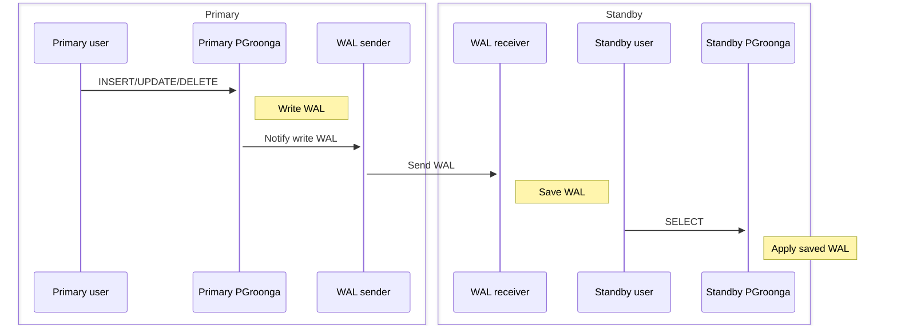

# ストリーミングレプリケーション

PGroongaは1.1.6からPostgreSQL組み込みの[WALベースのストリーミングレプリケーション機能][postgresql-wal]をサポートしています。

PGroonga 3.2.1以降とPostgreSQL 15以降を使っている場合は[WALリソースマネージャーを使ったストリーミングレプリケーション][streaming-replication-wal-resource-manager]の方がオススメです。

PGroongaのWALは以下のようにスタンバイのサーバーへ送信されます。



WALをサポートしているといってもクラッシュセーフではないことに注意してください。WALベースのストリーミングレプリケーションをサポートしているだけです。もし、PGroongaのインデックスを更新している最中にPostgreSQLがクラッシュしたら、そのPGroongaのインデックスは壊れるかもしれません。もし、PGroongaのインデックスが壊れたら[`REINDEX`][postgresql-reindex]で作り直さなければいけません。

参考：[クラッシュセーフ][crash-safe]

このドキュメントではPostgreSQL組み込みのWALベースのストリーミングレプリケーション機能をPGroonga用に設定する方法を説明します。多くの手順は通常のストリーミングレプリケーションの設定手順です。いくつかPGroonga固有の手順があります。

## 概要

PostgreSQL組み込みのWALベースのストリーミングレプリケーション機能をPGroonga用に設定する手順は次の通りです。「[通常]」タグは通常のストリーミングレプリケーション用の手順であることを示しています。「[固有]」タグはPGroonga固有の手順であることを示しています。

  1. [通常] [プライマリーとスタンバイでPostgreSQLをインストールする](#install-postgresql)

  2. [固有] [プライマリーとスタンバイでPGroongaをインストールする](#install-pgroonga)

  3. [通常] [プライマリーでストリーミングレプリケーション用にPostgreSQLを設定する](#configure-replication-primary)

  4. [固有] [プライマリーでPGroonga用にPostgreSQLを設定する](#configure-pgroonga-primary)

  5. [通常] [プライマリーでデータを追加する](#insert-primary)

  6. [固有] [プライマリーでPGroongaのインデックスを作る](#create-pgroonga-index-primary)

  7. [固有] [プライマリーでPGroonga関連のデータを書き出す](#flush-pgroonga-data-primary)

  8. [通常] [スタンバイで`pg_basebackup`を実行する](#pg-basebackup-standbys)

  9. [固有] [スタンバイでPGroonga用にPostgreSQLを設定する](#configure-pgroonga-standbys)

  10. [通常] [スタンバイでPostgreSQLを起動する](#start-standbys)

## 例で使う環境

このドキュメントでは次の環境を使います。

  * プライマリー：

    * OS: Ubuntu 22.04

    * IPアドレス：192.168.0.30

    * データベース名：`blog`

    * レプリケーションユーザー名：`replicator`

    * レプリケーションユーザーのパスワード：`passw0rd`

  * スタンバイ1：

    * OS: Ubuntu 22.04

    * IPアドレス：192.168.0.31

  * スタンバイ2：

    * OS: Ubuntu 22.04

    * IPアドレス：192.168.0.32

このドキュメントではUbuntu 22.04用のコマンドラインを書いています。もし、他のプラットフォームを使っている場合は自分でコマンドラインを調整してください。

## [通常] プライマリーとスタンバイでPostgreSQLをインストールする {#install-postgresql}

これは通常の手順です。

プライマリーとスタンバイでPostgreSQL 15をインストールします。

```bash
sudo apt install -y gpg lsb-release wget
wget --quiet -O - https://www.postgresql.org/media/keys/ACCC4CF8.asc | sudo gpg --no-default-keyring --keyring /usr/share/keyrings/pdgd-keyring.gpg --import -
echo "deb [signed-by=/usr/share/keyrings/pdgd-keyring.gpg] http://apt.postgresql.org/pub/repos/apt/ $(lsb_release -cs)-pgdg main" | sudo tee /etc/apt/sources.list.d/pgdg.list
sudo apt update
sudo apt install -y postgresql-15
```

## [固有] プライマリーとスタンバイでPGroongaをインストールする {#install-pgroonga}

これはPGroonga固有の手順です。

プライマリーとスタンバイでPGroongaをインストールします。

```bash
sudo apt install -y software-properties-common
sudo add-apt-repository -y universe
sudo add-apt-repository -y ppa:groonga/ppa
sudo apt install -y wget lsb-release
wget https://packages.groonga.org/ubuntu/groonga-apt-source-latest-$(lsb_release --codename --short).deb
sudo apt install -y -V ./groonga-apt-source-latest-$(lsb_release --codename --short).deb
sudo apt update
sudo apt install -y -V postgresql-15-pgdg-pgroonga
```

## [通常] プライマリーでストリーミングレプリケーション用にPostgreSQLを設定する {#configure-replication-primary}

これは通常の手順です。

プライマリーでだけ次のストリーミングレプリケーション用の設定を`postgresql.conf`に追加します。

  * `listen_addresses = 'localhost,192.168.0.30'`

多くのスタンバイがいる場合は`max_wal_senders`も設定する必要があります。`max_wal_senders`のデフォルト値は`10`です。スタンバイ2台では`10`で十分です。

[PostgreSQL：ドキュメント：レプリケーション][postgresql-replication]も参照してください。

`/etc/postgresql/15/main/postgresql.conf`:

変更前：

```vim
#listen_addresses = 'localhost'
```

変更後：

```vim
listen_addresses = 'localhost,192.168.0.30'
```

プライマリーでだけ以下のストリーミングレプリケーション用の設定を`pg_hba.conf`に追加します。

  * `192.168.0.0/24`からのレプリケーションユーザー`replicator`でのレプリケーション接続を許可します。

`/etc/postgresql/15/main/pg_hba.conf`:

変更前：

```vim
local   replication     all                                     peer
host    replication     all             127.0.0.1/32            scram-sha-256
host    replication     all             ::1/128                 scram-sha-256
```

変更後：

```vim
local   replication     all                                     peer
host    replication     all             127.0.0.1/32            scram-sha-256
host    replication     all             ::1/128                 scram-sha-256
host    replication     all             192.168.0.0/24          scram-sha-256
```

プライマリーでだけレプリケーションユーザーを作成します。

```console
$ sudo -u postgres -H createuser --pwprompt --replication replicator
Enter password for new role: (passw0rd)
Enter it again: (passw0rd)
```

## [固有] プライマリーでPGroonga用にPostgreSQLを設定する {#configure-pgroonga-primary}

これはPGroonga固有の手順です。

PGroongaのWAL関連の設定とクラッシュセーフ関連の設定を追加する必要があります。

PGroongaのWAL用には、[`pgronga.enable_wal`パラメーター][enable-wal]と[`pgroonga.max_wal_size`パラメーター][max-wal-size]を設定する必要があります。

クラッシュセーフ用には、[`pgroonga_crash_safer`モジュール][pgroonga-crash-safer]を[`shared_preload_libraries`パラメーター][postgresql-shared-preload-libraries]に追加して`pgroonga.crash_safe = on`も追加する必要があります。

注意：`pgroonga_crash_safer`モジュールを使うと書き込み性能が低下します。メンテナンス性と性能のトレードオフがあります。最大の書き込み性能が必要な場合はこのモジュールを使えません。このトレードオフ人ついては[クラッシュセーフ][crash-safe]も参照してください。

`/etc/postgresql/15/main/postgresql.conf`:

変更前：

```vim
#shared_preload_libraries = ''
```

変更後：

```vim
shared_preload_libraries = 'pgroonga_crash_safer'
```

`/etc/postgresql/15/main/conf.d/pgroonga.conf`:

```vim
pgroonga.enable_wal = on
pgroonga.max_wal_size = 100MB
pgroonga.enable_crash_safe = on
```

書き込みが激しいシステムでは`pgroonga.max_wal_size`の値をもっと大きくしないといけないかもしれません。

`pgroonga_crash_safer`モジュールを使わない場合は、`shared_preload_libraries`から`pgroonga_crash_safer`を除いて、`pgroonga.enable_crash_safe = on`も消します。

この設定を反映するためにPostgreSQLを再起動します。

```bash
sudo -H systemctl restart postgresql
```

## [通常] プライマリーでデータを挿入する {#insert-primary}

これは通常の手順です。

プライマリーでだけ一般ユーザーを作成します。

```bash
sudo -u postgres -H createuser ${USER}
```

プライマリーでだけデータベースを作成します。

```bash
sudo -u postgres -H createdb --template template0 --locale C --encoding UTF-8 --owner ${USER} blog
```

プライマリーでだけ作成したデータベースにテーブルを追加します。

作成した`blog`データベースに接続します。

```bash
psql blog
```

`entries`テーブルを作成します。

```sql
CREATE TABLE entries (
  title text,
  body text
);
```

作成した`entries`テーブルにデータを追加します。

```sql
INSERT INTO entries VALUES ('PGroonga', 'PGroonga is a PostgreSQL extension for fast full text search that supports all languages. It will help us.');
INSERT INTO entries VALUES ('Groonga', 'Groonga is a full text search engine used by PGroonga. We did not know about it.');
INSERT INTO entries VALUES ('PGroonga and replication', 'PGroonga 1.1.6 supports WAL based streaming replication. We should try it!');
```

## [固有] プライマリーでPGroongaのインデックスを作成する {#create-pgroonga-index-primary}

これはPGroonga固有の手順です。

このデータベースにPGroongaをインストールします。スーパーユーザー権限が必要です。

```bash
sudo -u postgres -H psql blog --command "CREATE EXTENSION pgroonga;"
sudo -u postgres -H psql blog --command "GRANT USAGE ON SCHEMA pgroonga TO ${USER};"
```

再度一般ユーザーでPostgreSQLに接続します。

```bash
psql blog
```

プライマリーでPGroongaのインデックスを作成します。

```sql
CREATE INDEX entries_full_text_search ON entries USING pgroonga (title, body);
```

作成したインデックスを確認します。

```sql
SET enable_seqscan TO off;
SELECT title FROM entries WHERE title &@~ 'replication';
--           title           
-- --------------------------
--  PGroonga and replication
-- (1 row)
```

## [固有] プライマリーでだけPGroonga関連のデータをフラッシュする {#flush-pgroonga-data-primary}

これはPGroonga固有の手順です。

プライマリーでだけメモリー上にあるPGroonga関連のデータを確実にディスクに書き出します。以下のどれかの方法を使います。

  1. `SELECT pgroonga_command('io_flush');`を実行する

  2. すべての接続を切断する

`pgroonga_command('io_flush')`を使う場合は次のようになります。

```sql
SELECT pgroonga_command('io_flush') AS command;
--                     command                    
-- -----------------------------------------------
--  [[0,1478446349.2241,0.1413860321044922],true]
-- (1 row)
```

プライマリーでは、次の`pg_basebackup`の手順が終わるまではPGroongaのインデックスを使っているテーブルを変更してはいけません。

## [通常] スタンバイで`pg_basebackup`を実行する {#pg-basebackup-standbys}

これは通常の手順です。

スタンバイでだけ`pg_basebackup`を実行します。`pg_basebackup`はプライマリーから現在のデータベースをコピーします。

スタンバイ：

```console
$ sudo -H systemctl stop postgresql
$ sudo -u postgres -H rm -rf /var/lib/postgresql/15/main
$ sudo -u postgres -H pg_basebackup --host 192.168.0.30 -D /var/lib/postgresql/15/main --progress -U replicator -R
Password: (passw0rd)
175007/175007 kB (100%), 1/1 tablespace
```

## [固有] スタンバイでPGroonga用にPostgreSQLを設定する {#configure-pgroonga-standbys}

これはPGroonga固有の手順です。

2.4.2で追加。

次のモジュールを[`shared_preload_libraries`パラメーター][postgresql-shared-preload-libraries]に追加します。

  * [`pgroonga_standby_maintainer`モジュール][pgroonga-standby-maintainer]

  * [`pgroonga_crash_safer`モジュール][pgroonga-crash-safer]

注意：`pgroonga_crash_safer`モジュールを使うと書き込み性能が低下します。メンテナンス性と性能のトレードオフがあります。最大の書き込み性能が必要な場合はこのモジュールを使えません。このトレードオフ人ついては[クラッシュセーフ][crash-safe]も参照してください。

スタンバイ：

`/etc/postgresql/15/main/postgresql.conf`:

変更前：

```vim
#shared_preload_libraries = ''
```

変更後：

```vim
shared_preload_libraries = 'pgroonga_standby_maintainer,pgroonga_crash_safer'
```

スタンバイ：

`/etc/postgresql/15/main/conf.d/pgroonga.conf`:

```vim
pgroonga.enable_wal = on
pgroonga.enable_crash_safe = on
```

`pgroonga_crash_safer`モジュールを使わない場合は、`shared_preload_libraries`から`pgroonga_crash_safer`を除いて、`pgroonga.enable_crash_safe = on`も消します。

## [通常] スタンバイでPostgreSQLを起動する {#start-standbys}

これは通常の手順です。

スタンバイでPostgreSQLを起動します。

```bash
sudo -H systemctl start postgresql
```

これで、プライマリーで挿入したデータをプライマリーで作成したPGroongaのインデックスで検索できます。

スタンバイ1：

```bash
psql blog
```

```sql
SET enable_seqscan TO off;
SELECT title FROM entries WHERE title &@~ 'replication';
--           title           
-- --------------------------
--  PGroonga and replication
-- (1 row)
```

`pg_basebacup`以降にプライマリーで追加したデータも検索できます。

プライマリー：

```sql
INSERT INTO entries VALUES ('PostgreSQL 9.6 and replication', 'PostgreSQL supports generic WAL since 9.6. It is required for replication for PGroonga.');
```

スタンバイ1：

```sql
SELECT title FROM entries WHERE title &@~ 'replication';
--              title              
-- --------------------------------
--  PGroonga and replication
--  PostgreSQL 9.6 and replication
-- (2 rows)
```

スタンバイ2：

```bash
psql blog
```

```sql
SET enable_seqscan TO off;
SELECT title FROM entries WHERE title &@~ 'replication';
--              title              
-- --------------------------------
--  PGroonga and replication
--  PostgreSQL 9.6 and replication
-- (2 rows)
```

[postgresql-wal]:{{ site.postgresql_doc_base_url.ja }}/warm-standby.html

[streaming-replication-wal-resource-manager]:streaming-replication-wal-resource-manager.html

[postgresql-reindex]:{{ site.postgresql_doc_base_url.ja }}/sql-reindex.html

[crash-safe]:crash-safe.html

[postgresql-replication]:{{ site.postgresql_doc_base_url.ja }}/runtime-config-replication.html

[enable-wal]:parameters/enable-wal.html
[max-wal-size]:parameters/max-wal-size.html

[pgroonga-standby-maintainer]:modules/pgroonga-standby-maintainer.html

[pgroonga-crash-safer]:modules/pgroonga-crash-safer.html

[postgresql-shared-preload-libraries]:{{ site.postgresql_doc_base_url.ja }}/runtime-config-client.html#GUC-SHARED-PRELOAD-LIBRARIES
