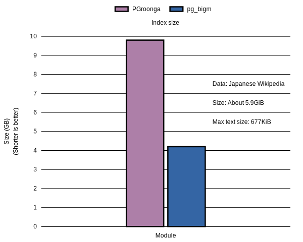

# PGroonga versus pg\_bigm

PostgreSQL doesn't support full text search for non alphabet based languages such as Asian languages including Japanese, Chinese and Korean by default. There are some third party modules to support Asian languages. PGroonga is one of them. [pg\_bigm](http://pgbigm.osdn.jp/index_en.html) is another module. There are some textsearch parsers such as [zhparser](https://github.com/amutu/zhparser) for Chinese and [textsearch\_ja (not maintained)](http://textsearch-ja.projects.pgfoundry.org/textsearch_ja.html) for Japanese.

The pg\_bigm module is similar to the [pg\_trgm]({{ site.postgresql_doc_base_url.en }}/pgtrgm.html) module. The pg\_trgm module doesn't support Asian languages by default but the pg\_bigm module supports them.

This documents describes about difference between PGroonga and pg\_bigm.

## Characteristics

Here are characteristics of each modules.

### PGroonga {#pgroonga}

PGroonga is fast for searching because it doesn't need "recheck".

PGroonga is also fast for searching while updating because it doesn't block searching while updating. PGroonga doesn't decrease search performance while updating.

PGroonga is also fast for alphabet based languages and Asian languages mixed case. PGroonga uses N-gram based full text search by default. It's similar to pg\_bigm because pg\_bigm uses 2-gram (N is 2 case of N-gram). But PGroonga uses variable size N-gram. N-gram is slower for alphabet based languages because the number of letter types are few in alphabet. It's about 26 ("a" to "z" and more). Posting list in inverted index will be longer when the number of letter types are few. (If you're not familiar with inverted index, you may not understand this description.) See also [PGroonga versus textsearch and pg\_trgm](pgroonga-versus-textsearch-and-pg-trgm.html). You can find pg\_trgm that uses N-gram based full text search is slower. PGroonga uses word based full text search instead of N-gram based full text search for alphabet based languages even if the target text mixes alphabet based languages and Asian languages such as "私はPostgreSQLユーザーです。".

PGroonga is also fast for updating.

PGroonga index is large because it keeps index target text that is already stored in PostgreSQL.

PGroonga index isn't crash safe. You need to run [`REINDEX`]({{ site.postgresql_doc_base_url.en }}/sql-reindex.html) when your PGroonga index is broken by crash.

### The pg\_bigm module {#pg-bigm}

The pg\_bigm module is crash safe because it uses GIN. GIN is crash safe.

The pg\_bigm module is slow when many documents are matched and each document is long. Because pg\_bigm need "recheck" after index search.

### Summary {#summary}

Module     | Supported languages | Search  | Update  | Size
---------- | --------------------| ------- | ------- | -------
PGroonga   | All                 | Faster  | Faster  | Larger
pg\_bigm   | All                 | Slower  | Slower  | Smaller

## Benchmark {#benchmark}

This section shows benchmark result against Japanese Wikipedia. You can find benchmark script at [postgresql.sh](https://github.com/groonga/wikipedia-search/blob/master/benchmark/centos7/postgresql.sh).

### Summary

Here is the summary of full text search index creation benchmark result:

  * PGroonga is the fastest module.

  * pg\_bigm is about 73% slower than PGroonga.


Here is the summary of full text search index size benchmark result:

  * pg\_bigm is the smallest module.

  * PGroonga is about 2.3 times larger than pg\_bigm.



Here is the summary of full text search performance benchmark result:

  * Full text search performance by pg\_bigm is about 50 times slower than other modules expect "日本" (two characters case).

  * Full text search performances of PGroonga and Groonga are similar expect "日本" (many hit records case).


Here is the full text search performance graph without pg\_bigm because pg\_bigm is about 50 times slower than other modules:


### Environment

Here is the benchmark environment:

CPU     | Intel(R) Xeon(R) CPU E5-2660 v3 @ 2.60GHz (24cores)
Memory  | 32GiB
Swap    | 2GiB
Storage | SSD (500GB)
OS      | CentOS 7.2

### Version

Here are the software versions:

PostgreSQL | PGroonga | pg\_bigm
---------- | -------- | ------------
9.6.1      | 1.1.9    | 1.2-20161011

### Data

Here are statistics of the target data:

Size                                | About 5.9GiB
The number of records               | About 900thousands
The average of title length in byte | About 21.6B
The max title length in byte        | 250B
The average of body length in byte  | About 6.7KiB
The max body length in byte         | About 677KiB

### Data load

Here is the benchmark result of data load. It's not related with full text search modules. Because any indexes aren't created yet.

Elapsed time   | Database size
-------------- | -------------
About 5minutes | About 5GB

Here is the SQL to load data:

```sql
COPY wikipedia FROM 'ja-all-pages.csv' WITH CSV ENCODING 'utf8';
```

You can download the CSV data at [ja-all-pages.csv.xz](https://packages.groonga.org/tmp/ja-all-pages.csv.xz).

Here is the SQL to define the `wikipedia` table:

```sql
CREATE TABLE wikipedia (
  id integer PRIMARY KEY,
  title text,
  text text
);
```

### Index creation

Here are benchmark results of creating full text search indexes:

Module     | Elapsed time    | Index size  | Note
---------- | --------------- | ----------- | -------------------------------------------------------------------------------------------------------------
PGroonga   | About 19minutes | About 9.8GB | PGroonga copies data and creates index from them. Data are compressed by zlib. Index only size is about 6.4GB.
pg\_bigm   | About 33minutes | About 4.2GB | `maintenance_work_mem` is `2GB`.

Here is the index definition of PGroonga:

```sql
CREATE INDEX wikipedia_index_pgroonga ON wikipedia
 USING pgroonga (title, text);
```

Here is the index definition of pg\_bigm:

```sql
CREATE INDEX wikipedia_index_pg_bigm ON wikipedia
 USING GIN (title gin_bigm_ops, text gin_bigm_ops);
```

### Full text search

Here are benchmark results of full text searches.

  * "Groonga" means `pgroonga_command('select ...')` result. See also [`pgroonga_command`](functions/pgroonga-command.html).

  * "Relative elapsed time" is the ratio between the target elapsed time and the fastest case elapsed time. Larger means slower.

Query: "テレビアニメ"

Module   | Elapsed time | N hits             | Relative elapsed time
-------- | ------------ | ------------------ | ---------------------
PGroonga | About 65ms   | About 20thousands  | About 1.1
Groonga  | About 38ms   | About 20thousands  | 1
pg\_bigm | About 2.8s   | About 20thousands  | About 48

Query: "データベース"

Module   | Elapsed time | N hits            | Relative elapsed time
-------- | ------------ | ----------------- | ---------------------
PGroonga | About 49ms   | About 15thousands | About 1.6
Groonga  | About 31ms   | About 15thousands | 1
pg\_bigm | About 1.3s   | About 15thousands | About 41


Query: "PostgreSQL OR MySQL"

Module   | Elapsed time | N hits | Relative elapsed time
-------- | ------------ | ------ | ---------------------
PGroonga | About 2ms    | 316    | About 2
Groonga  | About 1ms    | 316    | 1
pg\_bigm | About 49ms   | 311    | About 49

Query: "日本"

Module   | Elapsed time | N hits             | Relative elapsed time
-------- | ------------ | ------------------ | ---------------------
PGroonga | About 563ms  | About 530thousands | About 10
Groonga  | About 59ms   | About 530thousands | 1
pg\_bigm | About 479ms  | About 530thousands | About 8
