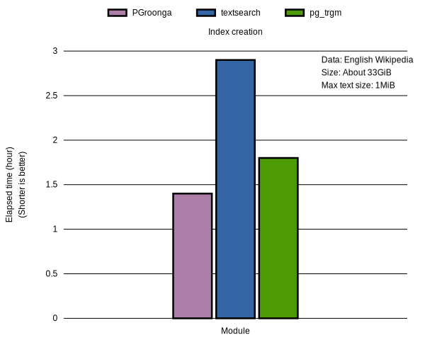
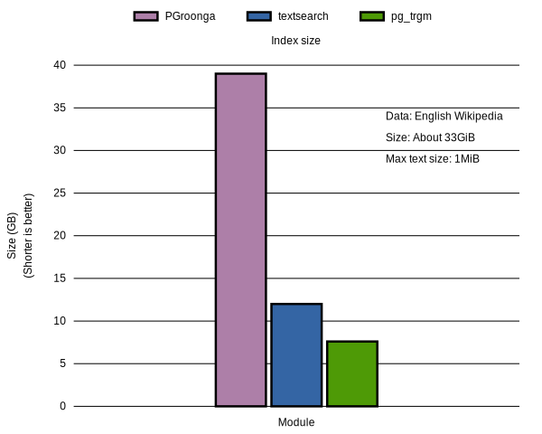
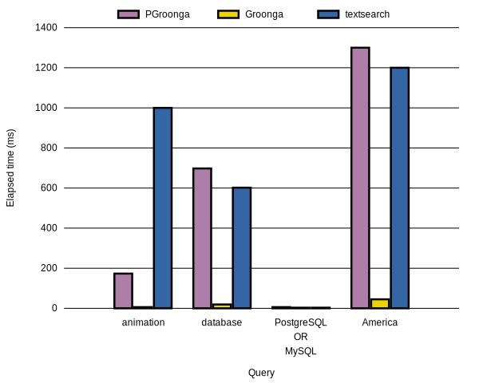

# PGroonga versus textsearch and pg\_trgm

PostgreSQL provides two full text search modules. They are [textsearch]({{ site.postgresql_doc_base_url.en }}/textsearch.html) and [pg\_trgm]({{ site.postgresql_doc_base_url.en }}/pgtrgm.html).

The textsearch module is a built-in full text search feature. It supports GiST and GIN indexes. If you use GiST or GIN index, you can improve full text search performance.

The pg\_trgm module is a contrib module. pg\_trgm provides full text search feature. pg\_trgm also supports GiST and GIN indexes. If you use GiST or GIN index, you can improve full text search performance.

This documents describes about difference between PGroonga, textsearch and pg\_trgm.

## Characteristics

Here are characteristics of each modules.

### PGroonga {#pgroonga}

PGroonga implements both language specific full text search and not language specific full text search. PGroonga uses not language specific full text search by default. Normally, PGroonga provides satisfactory full text search result by default.

PGroonga supports all languages by default because PGroonga uses not language specific full text search by default. You don't need to change source code.

PGroonga is fast for searching because it doesn't need "recheck".

PGroonga is also fast for searching while updating because it doesn't block searching while updating. PGroonga doesn't decrease search performance while updating.

PGroonga is also fast for updating.

PGroonga index is large because it keeps index target text that is already stored in PostgreSQL.

### The textsearch module {#textsearch}

The textsearch module implements language specific full text search. For example, English terms are stemmed. All of "work", "works" and "worked" are converted to "work". It'll improve [recall](https://en.wikipedia.org/wiki/Full-text_search#The_precision_vs._recall_tradeoff).

Language specific full text search may improve full text search feature but "language specific" means someone implements "language specific" process. PostgreSQL 9.6.1 supports 15 languages such as English, French and Russian but other many languages aren't supported such as Asian languages including Japanese, Chinese and Korean.

The textsearch module is fast for searching because it doesn't need "recheck". (If you use weight, you need "recheck".)

The textsearch module can't process very large text. `1MiB - 1B` is the max bytes of text. If you put 1MiB or more text, you will get the following error:

```text
string is too long for tsvector (XXX bytes, max 1048575 bytes)
```

### The pg\_trgm module {#pg-trgm}

The pg\_trgm module implements not language specific full text search. But pg\_trgm disables non ASCII characters support. It means that pg\_trgm doesn't support many Asian languages such as Japanese and Chinese by default. You need to comment out the following line in `contrib/pg_trgm/trgm.h` to enable non ASCII characters support:

```c
#define KEEPONLYALNUM
```

If you're using Debian based system, you can enable non ASCII characters support without changing pg\_trgm source code by using `C.UTF-8` locale.

The pg\_trgm module is slow when many documents are matched and each document is long. Because pg\_trgm need "recheck" after index search.

### Summary {#summary}

Module     | Supported languages                  | Search  | Update       | Size
---------- | ------------------------------------ | ------- | ------------ | -------
PGroonga   | All                                  | Faster  | Faster       | Larger
textsearch | 15 (Asian languages aren't included) | Faster  | More slower  | Smaller
pg\_trgm   | ASCII only languages                 | Slower  | Slower       | Smaller

## Benchmark {#benchmark}

This section shows benchmark result against English Wikipedia. You can find benchmark script at [postgresql.sh](https://github.com/groonga/wikipedia-search/blob/master/benchmark/centos7/postgresql.sh).

### Summary

Here is the summary of full text search index creation benchmark result:

  * PGroonga is the fastest module.

  * pg\_trgm is about 30% slower than PGroonga.

  * textsearch is about 2 times slower than PGroonga.



Here is the summary of full text search index size benchmark result:

  * pg\_trgm is the smallest module.

  * textsearch is about 60% larger than pg\_trgm.

  * PGroonga is about 5 times larger than pg\_trgm.



Here is the summary of full text search performance benchmark result:

  * Full text search performance by pg\_trgm is very slower than other modules.

  * Full text search performances of PGroonga and textsearch are similar.

  * Full text search performance of Groonga, full text search engine by PGroonga, is faster than PGroonga and textsearch. It's 10 times or more faster.


Here is the full text search performance graph without pg\_trgm because pg\_trgm is too slow:



### Environment

Here is the benchmark environment:

CPU     | Intel(R) Xeon(R) CPU E5-2660 v3 @ 2.60GHz (24cores)
Memory  | 32GiB
Swap    | 2GiB
Storage | SSD (500GB)
OS      | CentOS 7.2

### Version

Here are the software versions:

PostgreSQL | PGroonga
---------- | --------
9.6.1      | 1.1.9

### Data

Here are statistics of the target data:

Size                                | About 33GiB
The number of records               | About 5.3millions
The average of title length in byte | About 19.6B
The max title length in byte        | 211B
The average of body length in byte  | About 6.4KiB
The max body length in byte         | About 1MiB (1047190B)

It's important for textsearch that the max body length in byte is less than 1MiB. If it's equals to `1MiB - 1B` or more, you can't create textsearch index with the following error message:

```text
string is too long for tsvector (1618908 bytes, max 1048575 bytes)
```

### Data load

Here is the benchmark result of data load. It's not related with full text search modules. Because any indexes aren't created yet.

Elapsed time    | Database size
--------------- | -------------
About 26minutes | About 21GB

Here is the SQL to load data:

```sql
COPY wikipedia FROM 'en-all-pages.csv' WITH CSV ENCODING 'utf8';
```

You can download the CSV data at [en-all-pages.csv.xz](https://packages.groonga.org/tmp/en-all-pages.csv.xz).

Here is the SQL to define the `wikipedia` table:

```sql
CREATE TABLE wikipedia (
  id integer PRIMARY KEY,
  title text,
  text text
);
```

### Index creation

Here are benchmark results of creating full text search indexes:

Module     | Elapsed time           | Index size  | Note
---------- | ---------------------- | ----------- | -------------------------------------------------------------------------------------------------------------
PGroonga   | About 1hour 24minutes  | About 39GB  | PGroonga copies data and creates index from them. Data are compressed by zlib. Index only size is about 21GB.
textsearch | About 2hours 53minutes | About 12GB  | `maintenance_work_mem` is `2GB`. There are 3923 words that can't be indexed. (*)
pg\_trgm   | About 1hour 50minutes  | About 7.6GB | `maintenance_work_mem` is `2GB`.

(*) Here is the error message of the case:

```text
NOTICE:  word is too long to be indexed
DETAIL:  Words longer than 2047 characters are ignored.
```

Here is the index definition of PGroonga:

```sql
CREATE INDEX wikipedia_index_pgroonga ON wikipedia
 USING pgroonga (title, text);
```

Here is the index definition of textsearch:

```sql
CREATE INDEX wikipedia_index_textsearch ON wikipedia
 USING GIN (to_tsvector('english', title),
            to_tsvector('english', text));
```

Here is the index definition of pg\_trgm:

```sql
CREATE INDEX wikipedia_index_pg_trgm ON wikipedia
 USING GIN (title gin_trgm_ops, text gin_trgm_ops);
```

### Full text search

Here are benchmark results of full text searches.

  * "Groonga" means `pgroonga_command('select ...')` result. See also [`pgroonga_command`](functions/pgroonga-command.html).

  * "Relative elapsed time" is the ratio between the target elapsed time and the fastest case elapsed time. Larger means slower.

Query: "animation"

Module     | Elapsed time | N hits             | Relative elapsed time | Note
---------- | ------------ | ------------------ | --------------------- | ----
PGroonga   | About 173ms  | About 40thousands  | About 29              |
Groonga    | About 6ms    | About 40thousands  | 1                     |
textsearch | About 1s     | About 420thousands | About 167             | N hits is about 10 times than other cases. It's caused by stemming. "animation" is stemmed as "anim" and "anim" is searched.
pg\_trgm   | About 44s    | About 30thousands  | About 7333            |

Query: "database"

Module     | Elapsed time | N hits             | Relative elapsed time
---------- | ------------ | ------------------ | ---------------------
PGroonga   | About 698ms  | About 210thousands | About 37
Groonga    | About 19ms   | About 210thousands | 1
textsearch | About 602ms  | About 190thousands | About 32
pg\_trgm   | About 33s    | About 130thousands | About 1736


Query: "PostgreSQL OR MySQL"

Module     | Elapsed time | N hits             | Relative elapsed time
---------- | ------------ | ------------------ | ---------------------
PGroonga   | About 6ms    | 1636               | About 2
Groonga    | About 3ms    | 1636               | 1
textsearch | About 3ms    | 1506               | 1
pg\_trgm   | About 241ms  | 1484               | About 80

Query: "America"

Module     | Elapsed time | N hits             | Relative elapsed time
---------- | ------------ | ------------------ | ---------------------
PGroonga   | About 1.3s   | About 470thousands | About 29
Groonga    | About 45ms   | About 470thousands | 1
textsearch | About 1.2s   | About 480thousands | About 26
pg\_trgm   | About 1m32s  | About 1.4millions  | About 2044
