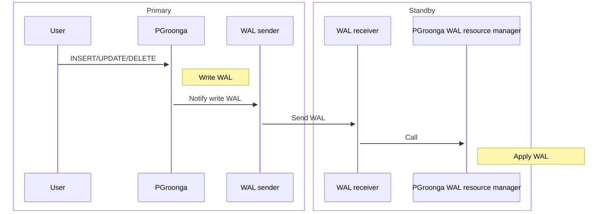

# Streaming replication by WAL resource manager

PGroonga supports WAL resource manager based on PostgreSQL [Custom WAL Resource Managers][postgresql-custom-wal-resource-managers] since 3.2.1. Custom WAL resource managers is available since PostgreSQL 15.

This makes the operation of WAL based streaming replication simple.

PGroonga's WAL is processed as the following:



This document describes how to configure PostgreSQL built-in WAL based streaming replication in combination with PGroonga WAL resource manager. Most of steps are normal steps. There are some PGroonga specific steps.

## Summary

Here are steps to configure PostgreSQL built-in WAL based streaming replication in combination with PGroonga WAL resource manager. "[normal]" tag means that the step is a normal step for streaming replication. "[special]" tag means that the step is a PGroonga specific step.

  1. [normal] [Install PostgreSQL on both primary and standbys](#install-postgresql)

  2. [special] [Install PGroonga on both primary and standbys](#install-pgroonga)

  3. [normal] [Configure PostgreSQL for streaming replication on primary](#configure-replication-primary)

  4. [special] [Configure PostgreSQL for PGroonga on primary](#configure-pgroonga-primary)

  5. [normal] [Insert data on primary](#insert-primary)

  6. [special] [Create a PGroonga index on primary](#create-pgroonga-index-primary)

  7. [special] [Flush PGroonga related data on primary](#flush-pgroonga-data-primary)

  8. [normal] [Run `pg_basebackup` on standbys](#pg-basebackup-standbys)

  9. [special] [Configure PostgreSQL for PGroonga on standbys](#configure-pgroonga-standbys)

  10. [normal] [Start PostgreSQL on standbys](#start-standbys)

This document uses the following environment:

  * Primary:

    * OS: Ubuntu 24.04

    * IP address: 192.168.0.30

    * Database name: `blog`

    * Replication user name: `replicator`

    * Replication user password: `passw0rd`

  * Standby1:

    * OS: Ubuntu 24.04

    * IP address: 192.168.0.31

  * Standby2:

    * OS: Ubuntu 24.04

    * IP address: 192.168.0.32

This document shows command lines for Ubuntu 24.04. If you're using other platforms, adjust command lines by yourself.

## [normal] Install PostgreSQL on both primary and standbys {#install-postgresql}

This is a normal step.

Install PostgreSQL 16 on both primary and standbys:

```bash
sudo apt install -y gpg lsb-release wget
wget --quiet -O - https://www.postgresql.org/media/keys/ACCC4CF8.asc | sudo gpg --no-default-keyring --keyring /usr/share/keyrings/pdgd-keyring.gpg --import -
echo "deb [signed-by=/usr/share/keyrings/pdgd-keyring.gpg] http://apt.postgresql.org/pub/repos/apt/ $(lsb_release -cs)-pgdg main" | sudo tee /etc/apt/sources.list.d/pgdg.list
sudo apt update
sudo apt install -y postgresql-16
```

## [special] Install PGroonga on both primary and standbys {#install-pgroonga}

This is a PGroonga specific step.

Install PGroonga on both primary and standbys.

```bash
sudo apt install -y software-properties-common
sudo add-apt-repository -y universe
sudo add-apt-repository -y ppa:groonga/ppa
sudo apt install -y lsb-release
wget https://packages.groonga.org/ubuntu/groonga-apt-source-latest-$(lsb_release --codename --short).deb
sudo apt install -y -V ./groonga-apt-source-latest-$(lsb_release --codename --short).deb
rm -f groonga-apt-source-latest-$(lsb_release --codename --short).deb
sudo apt update
sudo apt install -y -V postgresql-16-pgdg-pgroonga
```

## [normal] Configure PostgreSQL for streaming replication on primary {#configure-replication-primary}

This is a normal step.

Add the following streaming replication configurations to `postgresql.conf` on only primary:

  * `listen_addresses = 'localhost,192.168.0.30'`

If you have many standbys, you need to specify `max_wal_senders` too. The default `max_wal_senders` is `10`. `10` is enough value for 2 standbys.

See also [PostgreSQL: Documentation: Replication][postgresql-replication].

`/etc/postgresql/16/main/postgresql.conf`:

Before:

```conf
#listen_addresses = 'localhost'
```

After:

```conf
listen_addresses = 'localhost,192.168.0.30'
```

Add the following streaming replication configurations to `pg_hba.conf` on only primary:

  * Accept replication connection by the replication user `replicator` from `192.168.0.0/24`.

`/etc/postgresql/16/main/pg_hba.conf`:

Before:

```conf
local   replication     all                                     peer
host    replication     all             127.0.0.1/32            scram-sha-256
host    replication     all             ::1/128                 scram-sha-256
```

After:

```conf
local   replication     all                                     peer
host    replication     all             127.0.0.1/32            scram-sha-256
host    replication     all             ::1/128                 scram-sha-256
host    replication     all             192.168.0.0/24          scram-sha-256
```

Create the user for replication on only primary:

```console
$ sudo -u postgres -H createuser --pwprompt --replication replicator
Enter password for new role: (passw0rd)
Enter it again: (passw0rd)
```

## [special] Configure PostgreSQL for PGroonga on primary {#configure-pgroonga-primary}

This is a PGroonga specific step.

You need to add PGroonga's WAL resource manager related configurations and crash safe related configurations.

For PGroonga's WAL resource manager, you need to add [`pgroonga_wal_resource_manager` module][pgroonga-wal-resource-manager] to [`shared_preload_libraries` parameter][postgresql-shared-preload-libraries] and add [`pgronga.enable_wal_resource_manager = on`][enable-wal-resource-manager].

For crash safe, you need to add [`pgroonga_crash_safer` module][pgroonga-crash-safer] module to [`shared_preload_libraries` parameter][postgresql-shared-preload-libraries] and add `pgroonga.enable_crash_safe = on`.

NOTE: `pgroonga_crash_safer` module reduces write performance. There is a trade-off for easy to maintain and performance. If you need maximum write performance, you can't use this module. See also [Crash safe][crash-safe] for the trade-off.

`/etc/postgresql/16/main/postgresql.conf`:

Before:

```conf
#shared_preload_libraries = ''
```

After:

```conf
shared_preload_libraries = 'pgroonga_wal_resource_manager,pgroonga_crash_safer'
```

`/etc/postgresql/16/main/conf.d/pgroonga.conf`:

```conf
pgroonga.enable_wal_resource_manager = on
pgroonga.enable_crash_safe = on
```

If you don't use `pgroonga_crash_safer` module, you need to remove `pgroonga_crash_safer` from `shared_preload_libraries` and remove `pgroonga.enable_crash_safe = on`.

Restart PostgreSQL to apply the configuration:

```bash
sudo -H systemctl restart postgresql
```

## [normal] Insert data on primary {#insert-primary}

This is a normal step.

Create a normal user on only primary:

```bash
sudo -u postgres -H createuser ${USER}
```

Create a database on only primary:

```bash
sudo -u postgres -H createdb --template template0 --locale C --encoding UTF-8 --owner ${USER} blog
```

Create a table in the created database on only primary.

Connect to the created `blog` database:

```bash
psql blog
```

Create `entries` table:

```sql
CREATE TABLE entries (
  title text,
  body text
);
```

Insert data to the created `entries` table:

```sql
INSERT INTO entries VALUES ('PGroonga', 'PGroonga is a PostgreSQL extension for fast full text search that supports all languages. It will help us.');
INSERT INTO entries VALUES ('Groonga', 'Groonga is a full text search engine used by PGroonga. We did not know about it.');
INSERT INTO entries VALUES ('PGroonga and replication', 'PGroonga 3.2.1 supports custom WAL resource manager. We should try it!');
```

## [special] Create a PGroonga index on primary {#create-pgroonga-index-primary}

This is a PGroonga specific step.

Install PGroonga to the database. It requires superuser privilege:

```bash
sudo -u postgres -H psql blog --command "CREATE EXTENSION pgroonga;"
sudo -u postgres -H psql blog --command "GRANT USAGE ON SCHEMA pgroonga TO ${USER};"
```

Connect to PostgreSQL by a normal user again:

```bash
psql blog
```

Create a PGroonga index on only primary:

```sql
CREATE INDEX entries_full_text_search ON entries USING pgroonga (title, body);
```

Confirm the index:

```sql
SET enable_seqscan TO off;
SELECT title FROM entries WHERE title &@~ 'replication';
--           title           
-- --------------------------
--  PGroonga and replication
-- (1 row)
```

## [special] Flush PGroonga related data on primary {#flush-pgroonga-data-primary}

This is a PGroonga specific step.

Ensure writing PGroonga related data on memory to disk on only primary. You can choose one of them:

  1. Run `SELECT pgroonga_command('io_flush');`

  2. Disconnect all connections

Here is an example to use `pgroonga_command('io_flush')`:

```sql
SELECT pgroonga_command('io_flush') AS command;
--                     command                    
-- -----------------------------------------------
--  [[0,1478446349.2241,0.1413860321044922],true]
-- (1 row)
```

You must not change tables that use PGroonga indexes on primary until the next `pg_basebackup` step is finished.

## [normal] Run `pg_basebackup` on standbys {#pg-basebackup-standbys}

This is a normal step.

Run `pg_basebackup` on only standbys. It copies the current database from primary.

Standbys:

```bash
sudo -H systemctl stop postgresql
sudo -u postgres -H rm -rf /var/lib/postgresql/16/main
```

Standby1:

You should use [Replication Slots][postgresql-replication-slots] for simple WAL management.

* `--create-slot`

* `--slot standby1`

  * `standby1` is an example. It is better to use a name that is easy to understand.

```console
$ sudo -u postgres -H pg_basebackup --create-slot --slot standby1 \
  --host 192.168.0.30 --pgdata /var/lib/postgresql/16/main --progress --username replicator --write-recovery-conf
Password: (passw0rd)
158949/158949 kB (100%), 1/1 tablespace
```

Standby2:

You should use [Replication Slots][postgresql-replication-slots] for simple WAL management.

* `--create-slot`

* `--slot standby2`

  * `standby2` is an example. It is better to use a name that is easy to understand.

```console
$ sudo -u postgres -H pg_basebackup --create-slot --slot standby2 \
  --host 192.168.0.30 --pgdata /var/lib/postgresql/16/main --progress --username replicator --write-recovery-conf
Password: (passw0rd)
158949/158949 kB (100%), 1/1 tablespace
```

## [special] Configure PostgreSQL for PGroonga on standbys {#configure-pgroonga-standbys}

This is a PGroonga specific step.

Add the following modules to [`shared_preload_libraries` parameter][postgresql-shared-preload-libraries]:

  * [`pgroonga_wal_resource_manager` module][pgroonga-wal-resource-manager]

NOTE: In standby, `pgroonga_crash_safer` is not needed. [`pgroonga_wal_resource_manager` module][pgroonga-wal-resource-manager] has crash recovery feature too.

Standbys:

`/etc/postgresql/16/main/postgresql.conf`:

Before:

```conf
#shared_preload_libraries = ''
```

After:

```conf
shared_preload_libraries = 'pgroonga_wal_resource_manager'
```

## [normal] Start PostgreSQL on standbys {#start-standbys}

This is a normal step.

Start PostgreSQL on standbys:

```bash
sudo -H systemctl start postgresql
```

Now, you can search data inserted on primary by PGroonga index created on primary.

Standby1:

```sql
SET enable_seqscan TO off;
SELECT title FROM entries WHERE title &@~ 'replication';
--           title           
-- --------------------------
--  PGroonga and replication
-- (1 row)
```

You can also search data inserted on primary after `pg_basebackup`.

Primary:

```sql
INSERT INTO entries VALUES ('PostgreSQL 15 and replication', 'PostgreSQL supports custom WAL resource manager since 15.');
```

Standby1:

```sql
SELECT title FROM entries WHERE title &@~ 'replication';
-              title              
-- -------------------------------
--  PGroonga and replication
--  PostgreSQL 15 and replication
-- (2 rows)
```

Standby2:

```sql
SET enable_seqscan TO off;
SELECT title FROM entries WHERE title &@~ 'replication';
--             title              
-- -------------------------------
--  PGroonga and replication
--  PostgreSQL 15 and replication
-- (2 rows)
```

[crash-safe]:crash-safe.html

[enable-wal-resource-manager]:parameters/enable-wal-resource-manager.html

[pgroonga-crash-safer]:modules/pgroonga-crash-safer.html

[pgroonga-wal-resource-manager]:modules/pgroonga-wal-resource-manager.html

[postgresql-custom-wal-resource-managers]:{{ site.postgresql_doc_base_url.en }}/custom-rmgr.html

[postgresql-replication]:{{ site.postgresql_doc_base_url.en }}/runtime-config-replication.html

[postgresql-replication-slots]:{{ site.postgresql_doc_base_url.en }}/warm-standby.html#STREAMING-REPLICATION-SLOTS

[postgresql-shared-preload-libraries]:{{ site.postgresql_doc_base_url.en }}/runtime-config-client.html#GUC-SHARED-PRELOAD-LIBRARIES

[postgresql-wal]:{{ site.postgresql_doc_base_url.en }}/warm-standby.html
